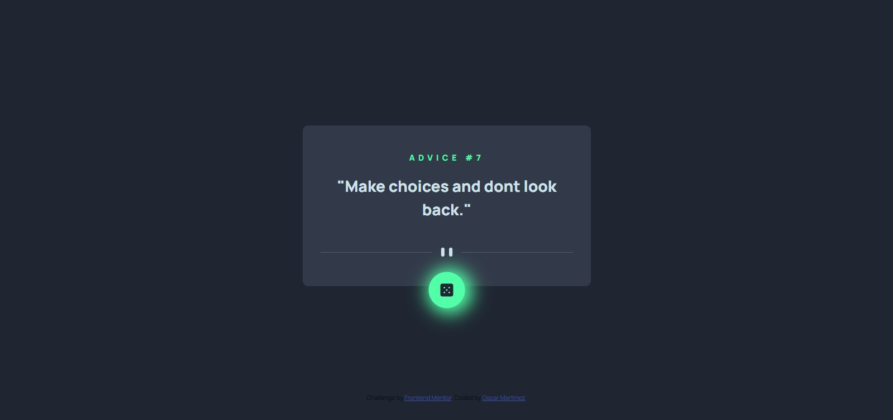

# Frontend Mentor - Advice generator app solution

This is a solution to the [Advice generator app challenge on Frontend Mentor](https://www.frontendmentor.io/challenges/advice-generator-app-QdUG-13db). Frontend Mentor challenges help you improve your coding skills by building realistic projects.

## Table of contents

- [Overview](#overview)
  - [The challenge](#the-challenge)
  - [Screenshot](#screenshot)
- [My process](#my-process)
  - [Built with](#built-with)
  - [What I learned](#what-i-learned)
- [Author](#author)
- [Acknowledgments](#acknowledgments)


## Overview

### The challenge

Users should be able to:

- View the optimal layout for the app depending on their device's screen size
- See hover states for all interactive elements on the page
- Generate a new piece of advice by clicking the dice icon

### Screenshot




## My process

### Built with

- Semantic HTML5 markup
- CSS custom properties
- Flexbox
- Mobile-first workflow

### What I learned

Through this project I learned how to fetch data from an API and how to render it into de DOM.

This is the script used to fetch the data that I find quite interesting as I need to get more familiar with this kind of projects.


```js
async function getRandomAdvice() {
    const resp = await fetch('https://api.adviceslip.com/advice');
    const respData = await resp.json();

    document.querySelector('.advice-number').innerHTML = `Advice #${respData.slip.id}`;
    document.querySelector('.advice-text').innerHTML = `"${respData.slip.advice}"`;

}

getRandomAdvice();

```


## Author
- Frontend Mentor - [@oscarm761](https://www.frontendmentor.io/profile/oscarmartinez761)
- Twitter - [@OscarOGMG](https://twitter.com/OscarOGMG)


